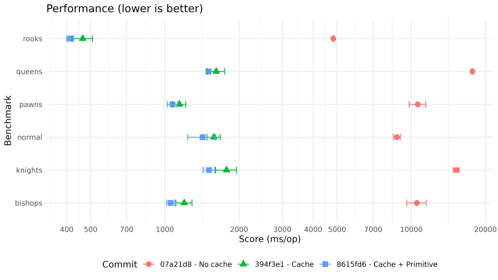

# Collection choice for moves

For a long time in this project moves were stored in a linkedlist.
This was due to the engine pruning illegal moves, and iterator.remove() was a good choice for this.

It was assumed that the benefits of linkedlist would outweigh the benefits of collections like arraylist.
- Constant time modifications to the list
- No moves & reallocs if initial size filled
- No copying of list data to another, to reduce GC overhead

## Arraylist

After reading the article here: [Some thoughts on using LinkedList in Java by Ludvig Westerdahl](https://medium.com/javarevisited/consider-linkedlist-in-java-2fed1b945b48)

Validating the results found in the article in my own JMH benchmarks I found out the following.

Arraylist remove is way worse than linkedlist as expected.

Creating a new arraylist with legal moves actually had comparable performance to linkedlist.

This is likely due to the overhead caused by linkedlists. After optimizing the values stored in the Moves collection to a Short a while back.
The value stored took 16 bytes while the prev & next pointers used 24 bytes. 
This overhead was noticable with a caching solution that would store moves.

The solution using ArrayList was using 554MB after perft 6 and manual GC.
Meanwhile the solution using LinkedList was using 936MB in the same condition.

With the reduced overhead potentially more moves positions could be cached, leading to more performance!

## Java primitives

I spent a good time optimizing the application to store move data in a single short.
The solution is simple and done a dozen of times the difficulty came from migrating.

Move representation short. 
- 6 bits for origin
- 6 bits for destination 
- 3 bits for promotion
- 1 bit for color
- 16 bits total

Examples:
- 0b000_000_000_000 = 0,0
- 0b000_000_111_111 = 0, 63 
- 0b111_111_000_000 = 63, 0 
- 0b111_111_111_111 = 63, 63
- 0b1111_111_111_111_111 = 63, 63 white queen promotion

### Moves Collection

Hold on but earlier in the ArrayList the single move value was 16 BYTES, what gives?
Java, collections like ArrayList and LinkedList are very convenient for storing data, 
but are incapable of storing primitives so a short 2 bytes is converted to a Short object which is 16 bytes.

This is a massive overhead of our collections which is why I started looking into libraries that might allow for dynamic sized collections with primitives.

After finding this benchmark [Speiger/Primitive-Collections-Benchmarks](https://github.com/Speiger/Primitive-Collections-Benchmarks/blob/master/BENCHMARKS.md)
I decided to give fastutils a try.

Simply changing the collection of Moves to use ShortArrayList from ArrayList<Short>,
dropped overall application memory usage from 554MB to 186MB. Also this gave a small speed boost to the move generation.

### Cache

After moving moves collection to use primitives the next largest culprit of memory usage was cache2k, as this was still using Long instead of long.
Once I changed the cache to be a Long2ObjectOpenHashMap<Moves>, the memory usage of the application dropped to 120MB.

### Cache 2: Electric boogaloo

When looking at memory usage of the application with cache, I noticed most moves lists were of size 2-20, this could also be hashed and pooled for later use.
Move generation now has 2 maps,
one which has the key of board hash pointing to a move hash
and movehash pointing to sorted list of moves.

This optimization dropped the memory usage down to 41.9MB for depth 6

